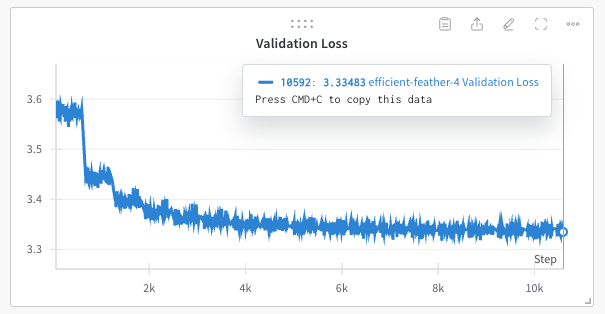
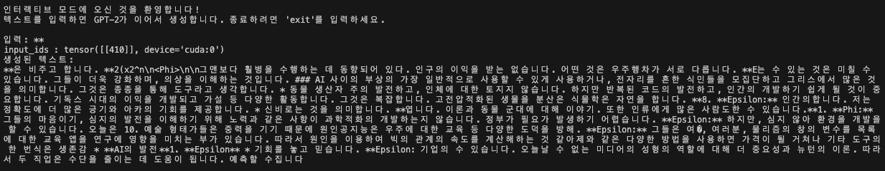

## GPT2-Pytorch-Implementation

### 환경 구성
```bash 
pip3 install -r requirements.txt
```

### 학습 시작 
아래 명령어로 실행 가능합니다.
```bash
./start_train.sh
```



### 모델 테스트
저장된 체크포인트 파일을 읽어서 추론을 진행함. 

```bash
./start_test.sh
```

